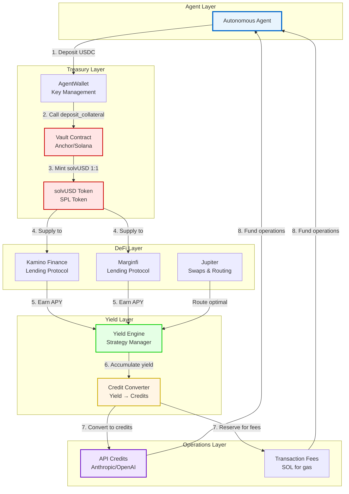
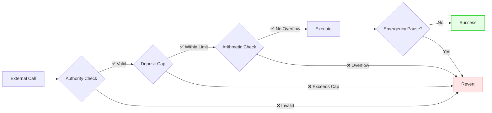
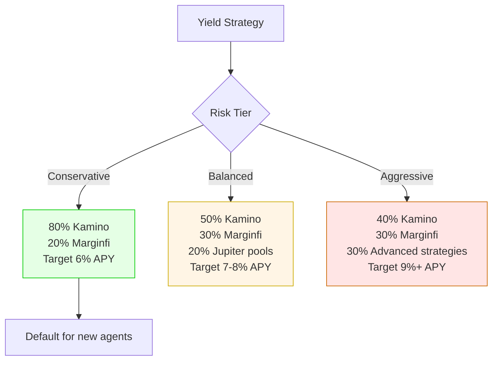

# SolvencyAI Architecture Diagram



## Flow Explanation

### Deposit Flow (Steps 1-3)
1. **Agent initiates deposit** via AgentWallet SDK
2. **Vault contract** receives USDC, validates, records collateral
3. **solvUSD minted** at 1:1 ratio, transferred to agent

### Yield Generation (Steps 4-5)
4. **Collateral deployed** to vetted DeFi protocols (Kamino, Marginfi)
5. **APY accrues** (target 6-9% annually)

### Credit Conversion (Steps 6-7)
6. **Yield accumulates** in Yield Engine
7. **Credit Converter** translates yield to API credits + SOL reserves

### Self-Funding Loop (Step 8)
8. **Agent withdraws** credits as needed, operates autonomously

## Security Layers



## Technology Stack

| Layer | Technology | Purpose |
|-------|-----------|---------|
| **Smart Contracts** | Anchor (Solana) | Vault management, security |
| **Token Standard** | SPL Token | solvUSD implementation |
| **DeFi Protocols** | Kamino, Marginfi | Yield generation |
| **Agent Runtime** | Node.js + AgentWallet | Autonomous operations |
| **Yield Routing** | Jupiter Aggregator | Optimal swap execution |
| **Key Management** | AgentWallet SDK | Secure signing |

## Capital Flow

```
$10,000 USDC deposit
  ↓
10,000 solvUSD minted (1:1)
  ↓
Deploy to Kamino (7% APY) + Marginfi (6% APY)
  ↓
Generate $650/year yield
  ↓
Convert to ~325,000 API calls
  ↓
Agent consumes 50-100 calls/day
  ↓
8+ years autonomous operation
```

## Risk Management



